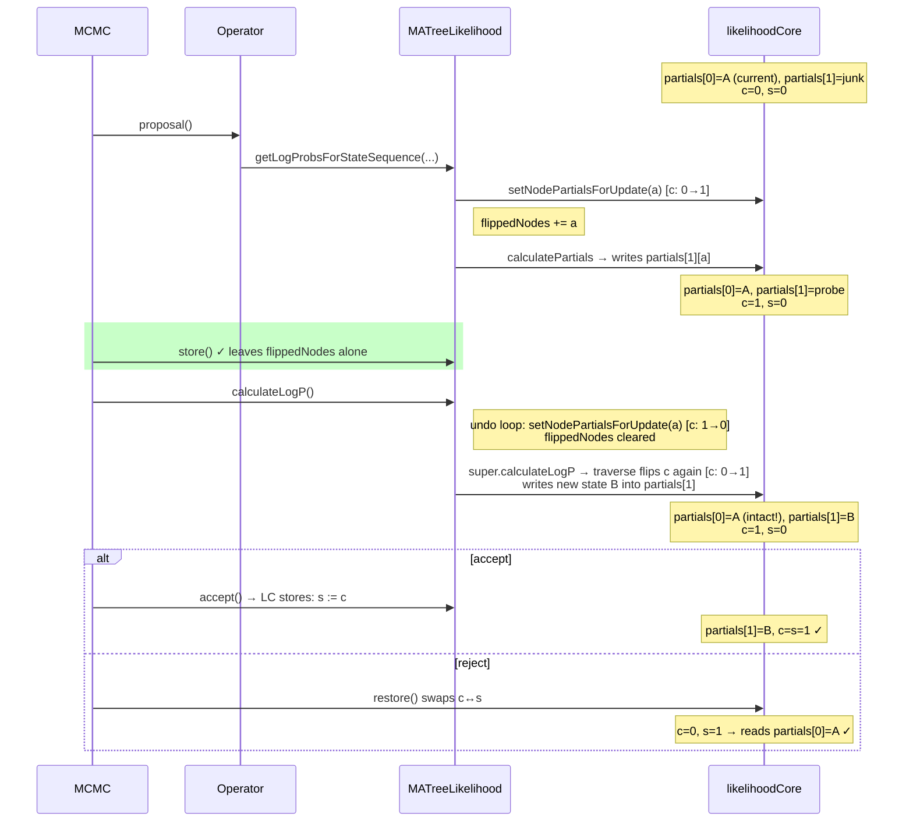

# Probe APIs and the store/restore lifecycle

In this document, **probe** means a speculative call to
`MATreeLikelihood.getLogProbsForStateSequence(nodeNr, sites)` (or its
partials variant `getLogProbsForPartialsSequence`): the caller is asking
*what would the per-site log likelihoods be if leaf `nodeNr` had this
sequence?* without committing to it as the new state. Gibbs-style
operators issue many such probes per proposal to build up their proposal
distribution.

The probe walks from `nodeNr` up to the root, recomputing partials at
every ancestor — which writes into BEAST2's `LikelihoodCore` buffers.
That side effect is the source of all the subtleties below: it has to be
managed against BEAST2's store/restore lifecycle so that the cached
partials representing the current accepted state survive untouched.

## The buffer model

`BeerLikelihoodCore` double-buffers internal-node partials with two
per-node arrays and a `currentPartialsIndex[a]` (call it `c`) that selects
the live slot, plus a `storedPartialsIndex[a]` (call it `s`) used by
`restore()`. After `store()` (which copies `c → s`), both `c` and `s` point
to the same data slot — that's the "stored" state to roll back to.

`setNodePartialsForUpdate(a)` flips `c[a]`. The contract is: callers flip
*before* writing new partials, so writes land in the scratch slot and the
stored slot stays intact. `restore()` swaps the index arrays, which has
the effect of pointing `c` back at the stored slot.

Tip states (when `useAmbiguities=false`) are *not* double-buffered —
there's a single `int[] states[nodeIndex]`. `MATreeLikelihood` patches over
this with `tempTipNodes` (track which tips were probed) and resync from
`MutableAlignment` in `restore()`.

## Where the timing trap lives

In one MCMC iteration, the framework calls (in order):

1. `state.store(sample)` — bookkeeping only, doesn't touch CalculationNodes
2. `operator.proposal()` — *probes happen here*
3. `state.storeCalculationNodes()` → `MATreeLikelihood.store()` — **after** the proposal, **before** evaluation
4. `posterior.calculateLogP()` → `MATreeLikelihood.calculateLogP()`
5. accept → `acceptCalculationNodes()`, or reject → `state.restore()` + `restoreCalculationNodes()`

Step 3 is the trap. Anything `store()` clears is wiped *between probes and
calculateLogP*, so any probe-tracking state set up during step 2 must
survive `store()`.

## Buggy flow (commit `c99c8f8`, before `af09f09`)

`store()` cleared `flippedNodes`, so the undo loop in `calculateLogP()`
saw an empty set and never flipped back. The framework's traverse then
flipped `c` again, rotating it back onto the stored slot and overwriting
the genuine pre-store partials.

```mermaid
sequenceDiagram
    participant MCMC
    participant Op as Operator
    participant MA as MATreeLikelihood
    participant LC as likelihoodCore

    Note over LC: partials[0]=A (current), partials[1]=junk<br/>c=0, s=0

    MCMC->>Op: proposal()
    Op->>MA: getLogProbsForStateSequence(...)
    MA->>LC: setNodePartialsForUpdate(a) [c: 0→1]
    Note right of MA: flippedNodes += a
    MA->>LC: calculatePartials → writes partials[1][a]

    Note over LC: partials[0]=A, partials[1]=probe<br/>c=1, s=0

    rect rgb(255, 200, 200)
    MCMC->>MA: store clears flippedNodes (BUG)
    end

    MCMC->>MA: calculateLogP()
    Note right of MA: undo loop is empty — c stays at 1
    MA->>LC: super.calculateLogP → traverse flips c again [c: 1→0]<br/>writes new state B into partials[0]

    Note over LC: partials[0]=B (overwrote A!), partials[1]=probe<br/>c=0, s=0

    MCMC->>LC: restore swaps c and s
    Note over LC: partials[0] is corrupt; next read returns B not A
```

## Fixed flow (commit `af09f09`)

`store()` no longer clears `flippedNodes` / `tempTipNodes`. The undo loop
in `calculateLogP()` flips `c` back to 0 *before* `super.calculateLogP()`
runs, so the framework's traverse-time flip lands at `c=1` (scratch),
leaving the stored slot intact.



## Why not a simpler design?

A localized "flip up, compute, flip back" inside `calcPatternLogLikelihoods`
would be self-contained and not need any cross-method state — except for
two reasons:

1. **Tip states are single-buffered in BEAST2.** `setNodeStatesForUpdate`
   is a no-op in `BeerLikelihoodCore`, so probes that mutate leaf states
   need `tempTipNodes` resync regardless. Localizing the partials half
   without addressing tip states would only solve half the problem.
2. **BEAGLE's tip states are not double-buffered either.** Even if we
   changed `BeerLikelihoodCore` to double-buffer states, the BEAGLE path
   (`BeagleMATreeLikelihood`) couldn't follow suit, so the workaround
   would still be needed there. Diverging the two paths costs more than
   the uniformity of the current design.

## Edge case left open

If an operator uses probes and then returns `Double.NEGATIVE_INFINITY`,
MCMC's failure path calls `state.restore()` but skips
`restoreCalculationNodes()` (when the operator's
`requiresStateInitialisation()` is `true`, the default). `MA.restore()`
never runs, so the tracking sets and probe-polluted scratch slots persist
into the next iteration. The `flippedNodes.add(...)` dedup will then skip
flips that should have happened, causing writes into the now-stored slot.

This isn't triggered by `phylonco`'s `ExchangeGibbsOperator` (all its
`NEGATIVE_INFINITY` early-returns happen *before* the first probe) but
would bite any future operator that probes and then returns
`NEGATIVE_INFINITY`.
